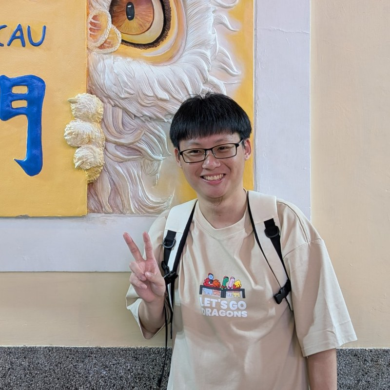

---
hide:
  - toc
---

# Hands-on Artificial Intelligence (AI) for Physical Sciences

## PHYS 5910-0 · Essential · Fall 2026

物理與人工智慧（AI）實作

This course develops practical machine-learning skills through physics datasets, guided notebook labs, paper reading, and a final project. The emphasis is not only on learning to use AI and machine-learning models, but on applying them to the right scientific problems and using physics domain expertise to judge whether their results hold.

### :material-calendar-clock: Class

**Time:** Monday 12:10–15:10, MnM5M6  
**Dates:** 7 September–21 December 2026  
**Room:** Physics Building 208 (物理館 208)  
**Format:** 1.5 h lecture + 1 h 20 m notebook lab  
**Language:** English

### :material-timer-outline: Time commitment

About **6–8 hours per week**: 3 hours in class, plus 3–5 hours of homework and project work.

!!! info "Start here"
    Check the [prerequisites](prerequisites.md), then read the [syllabus](syllabus.md) — it includes the [week-by-week schedule](syllabus.md#schedule) with materials and assignments.

## :material-target: What you will learn

By the end of the semester, you should be able to:

- prepare, version, and explore scientific datasets;
- build and evaluate machine-learning pipelines for physics data;
- compare ML models against meaningful baselines;
- diagnose training failures, leakage, and unsupported claims;
- read a current ML paper critically, reimplement its core idea, and test whether its assumptions transfer to a physics problem;
- use AI-assisted coding responsibly and verify generated work; and
- produce a reproducible computational result.

!!! note "First week"
    The first week of class is an ungraded orientation, and everything covered in it can be caught up afterwards. The first graded assignment follows in the second week.

## :material-calendar-check: Important dates

- **3–18 September:** Add/drop period
- **7 September:** First class; orientation and setup
- **14 December:** Final presentations I
- **21 December:** Final presentations II

## :material-account-group: Teaching team

### Instructor

{ .instructor-photo }

#### Yuan-Tang Chou 周圓唐

Assistant Professor, Department of Physics

**Email:** [ytchou@mx.nthu.edu.tw](mailto:ytchou@mx.nthu.edu.tw)  
**Office:** Room 508, General Building III  
**Website:** [yuantangchou.com](https://yuantangchou.com/)

### Teaching assistants

{ .instructor-photo }

#### Chen Wang

PhD student, Department of Physics

**Email:** [elian890415383@gmail.com](mailto:elian890415383@gmail.com)

## :material-clipboard-text: Logistics and policy

Assessment, submissions, and collaboration are covered in the
[syllabus](syllabus.md); what to prepare beforehand is on
[Prerequisites](prerequisites.md).

### Equipment

A laptop is all the hardware you need. Run the notebooks in
[Google Colab](https://colab.research.google.com/) or
[Kaggle](https://www.kaggle.com/) in the browser, or locally in VS Code — all
three provide a GPU, as does NSTC Core. See [Resources](resources.md).

### Generative AI ethics statement

Based on the principles of transparency and responsibility, this course
encourages students to use AI for collaboration or co-learning to improve the
quality of course outputs. This course adopts a **"conditional use with
disclosure of how generative AI is used in course outputs"** policy. Students
must briefly explain, in a footnote on the title page or after the references of
course assignments or reports, how AI was used, such as for topic ideation,
sentence polishing, or structural reference. If AI use is identified but not
disclosed as required, the instructor, university, or relevant unit may
re-evaluate the work or assign no credit. If instructors use AI to produce
teaching materials or learning resources, they should also appropriately
indicate such use in slides or orally. **By enrolling in this course, students
are considered to have agreed to the above ethics statement.**

This statement follows NTHU's guidance on generative AI in teaching and
learning, published by the
[Center for Teaching and Learning Development](https://ctld.site.nthu.edu.tw/p/406-1217-313902,r11492.php?Lang=zh-tw).

!!! note "How this applies in practice"
    AI-assisted coding is **strongly encouraged**, and you disclose it in the
    results you submit. See
    [Use of AI-assisted coding](syllabus.md#use-of-ai-assisted-coding).

    The same applies to me: this website and the course slides were built with
    the assistance of Claude Code, for drafting, formatting, and grammar checks.
